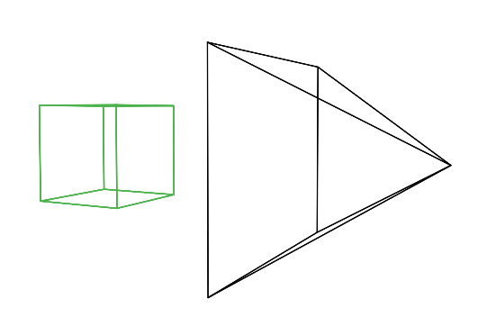

# Delve Deeper

## About The Project

This repository serves as a comprehensive introduction to ray tracing, delving into the foundational principles and implementation details of this powerful rendering technique. Starting from the basics of ray-object intersections to more advanced concepts like reflection, refraction, and recursive tracing, the content here covers a wide spectrum of ray tracing essentials.

The discussion explores the elegant simplicity of ray tracing algorithms, which, despite their straightforward nature, offer incredible depth in rendering scenes. It highlights the historical evolution of ray tracing, acknowledging its initially prohibitive computational demands and subsequent advancements that have made it a standard in rendering software today.

By following the journey through geometric solutions for ray-object intersections, extending to more sophisticated effects like reflection and refraction computations using algorithms introduced by pioneers like Arthur Appel and Turner Whitted, this repository provides a foundational understanding of how light interacts with objects in a simulated environment.

Moreover, it touches upon critical optimization strategies and techniques used to mitigate the inherent computational cost of ray tracing, paving the way for its widespread adoption in both offline rendering software and the recent advent of real-time ray tracing in gaming.

This collection of discussions and translated code samples, transitioning from C++ to Python, encapsulates the essence of ray tracing fundamentals. Whether you're a beginner seeking a fundamental understanding or an enthusiast looking to deepen your knowledge, this repository serves as a valuable resource in the realm of computer graphics and rendering.

## Raytracing Explained

Within this repository, we explore the fundamentals of 3D rendering. We'll delve into how a 3D scene is transformed into a 2D image for viewing, laying the groundwork for computer-generated imagery (CGI) creation.

Moving forward in this repository, we'll introduce and discuss the ray-tracing algorithm. Why focus on ray tracing here? It's a powerful method for simulating object visibility in scenes, making it a preferred choice for developing simple programs that generate 3D or computer-generated images.

Initially, we'll build the foundational knowledge around the ray-tracing algorithm. Once we've covered all essential aspects, we'll also explore implementing a scanline renderer within this repository.

For more in-depth details on ray tracing, feel free to explore specific sections or resources dedicated to it within this repository.

  

**Creating an Image: The Foundation**

To produce an image, we start with a two-dimensional surface—not a point, but an area. Imagine this as a cut through a pyramid, where the top is at our eye's center and the height is aligned with our line of sight. This cut, or slice, is what we call the image plane, akin to the canvas used by painters. It's a crucial concept in computer graphics, serving as the surface where we project our three-dimensional scene.

This idea is fundamental in creating images across various mediums. In photography, it's like the film's surface or the sensor in a digital camera. Similarly, painters use a canvas as their image plane.

Understanding this concept lays the groundwork for creating images on different devices and artistic platforms.

**Drawing a Cube on the Canvas**

Imagine wanting to draw a cube on a blank canvas. To do this, we start by drawing lines from each corner of the cube to our eye. These lines help us map the cube's shape onto the canvas. Each line intersects the canvas, creating points like c0', c1', c2', and c3'.

Let's say c0 is a corner connected to c1, c2, and c3. When we project these points onto the canvas, we get c0', c1', c2', and c3'. Connecting these points on the canvas with lines, following the edges of the cube, creates a two-dimensional representation of the cube.

This technique, called perspective projection, gives us our first image. By applying this method to all objects in a scene, we can create an image showing how the scene looks from a specific viewpoint.

Interestingly, painters began using these rules of perspective projection back in the 15th century to create realistic-looking scenes.

This version simplifies the process of projecting a cube onto a ca

  

**Adding Color and Light to Images**

After outlining three-dimensional objects on a flat surface, the next step is adding colors to complete the picture.

To summarize what we've learned: creating an image from a 3D scene involves two main steps. First, we project the shapes of 3D objects onto the image surface by connecting lines from the object's features to our eye. This step creates an outline on the canvas where these lines intersect the image plane. It's a geometric process. The second step is adding colors to this wireframe, a process called shading.

In a scene, an object's color and brightness come from how light interacts with its materials. Light consists of photons, electromagnetic particles carrying energy that oscillate like sound waves in straight lines. When photons hit an object, they can be absorbed, reflected, or transmitted. The proportions of these actions vary for different materials, determining how the object looks. But no matter what, the total incoming photons equal the sum of reflected, absorbed, and transmitted photons.

In science, we classify materials into two types: conductors (like metals) and dielectrics (like glass, plastic, wood). Dielectrics can be electrical insulators and can be transparent or opaque. For instance, glass and plastic are dielectric materials. Every material has some transparency to certain electromagnetic radiation; for example, X-rays can pass through the human body.

Objects can also have composite or multi-layered materials. For example, an object might be opaque (like wood) but have a transparent varnish on top, creating a mixed appearance of both diffuse and shiny surfaces.

  

**Understanding Object Color**

Imagine an opaque and diffuse object. For simplicity, let's say an object's color comes from absorbing certain parts of light. White light consists of "red," "blue," and "green" photons. When white light hits a red object, the object absorbs "green" and "blue" photons but reflects "red" photons. That's why we see the object as red—because the reflected "red" photons reach our eyes.

Each point on an illuminated object reflects light rays in all directions, but only some rays reach our eyes. These rays are what we see. Our eyes have photoreceptors that turn light into signals for our brain to interpret color shades.

This explanation is a simplified view of the color phenomenon. For a more detailed understanding, you can explore the lesson on color in the "Mathematics for Computer Graphics" section.

  

**Understanding Light Throughout History**

Understanding light has been a journey for humanity, much like grasping perspective projection. Early Greek thinkers believed that objects were seen by rays of light coming from the eyes. It wasn't until the work of Arab scientist Ibn al-Haytham (c. 965-1039) that a new understanding emerged. He explained that sunlight, consisting of streams of tiny particles traveling in straight lines, reflected from objects and formed images in our eyes (Figure 3).

Now, let's explore how we can recreate nature using a computer!

(<a href="#readme-top">back to top</a>)

**Understanding Seeing and Light**

Ibn al-Haytham's observations explain how we see objects. Two intriguing points arise from his insights:

Firstly, our ability to see depends entirely on light. Without light, we can't see anything.

Secondly, for us to perceive light, there must be objects around. In empty spaces like intergalactic regions, where there's no matter, even if photons are present, we perceive only darkness. However, if photons were there and reached our eyes, we would see the image of the object they were reflected from or emitted by.

So, in essence, our vision relies on the presence of both light and objects in our surroundings.

  

**Understanding Light and Vision in Computer-generated Images**

When simulating how light interacts with objects in computer-generated images, we must consider a key factor: not all the rays reflected by an object will reach our eyes.

Consider this: Imagine a light source that emits only one photon at a time. Let's track what happens to that photon. It travels in a straight line until it strikes the object's surface. Assuming it's reflected (ignoring absorption), it scatters randomly in various directions. If these photons reach the surface of our eye, we perceive the point from which they were reflected (Figure 1).

In essence, while many rays bounce off objects in a scene, only a few of them actually reach our eyes, forming what we perceive in computer-generated images.

Challenges with Forward Ray Tracing in Computer Graphics

When we use forward ray tracing, replacing our eyes with an image plane made of pixels, emitted photons hit pixels on this plane, brightening specific points. This process repeats until all pixels adjust, forming a computer-generated image. However, a problem arises: in reality, reflected rays go in countless directions, with a tiny chance of hitting the eye or a pixel.

Simulating many photons' interactions with objects in a scene is impractical in the computer world. If we try aiming photons directly at the eye's position, it's only effective for certain types of materials, not all. For instance, diffuse surfaces scatter light in various directions, but mirrors reflect light precisely, limiting how we redirect photons.

Even if we only simulate photons on diffuse surfaces, it's challenging. Picture spraying light rays onto an object's surface. Sparse rays won't uniformly illuminate all areas. It's like painting a teapot by dotting it with a marker on a black sheet; some parts remain uncovered until enough dots cover the surface.

  

Running the program until enough photons cover the surface accurately isn't feasible for production. While creating many photons isn't an issue, tracing their interactions within the scene is computationally expensive, mainly finding ray-geometry intersections.

Forward ray tracing technically mimics light in nature but has practical limitations. Turner Whitted, a computer graphics pioneer, highlighted this limitation in his paper, suggesting an alternate approach—tracing rays from the viewer to objects in the scene.

**Backward Ray-Tracing: Simulating from the Eye**

  

Instead of tracing rays from the light source to the eye, backward ray-tracing reverses this process, simulating rays from the eye position (Figure 2) towards the objects. This method, known as backward or eye tracing, addresses some issues faced in forward ray tracing.

In backward tracing, we compromise by tracing rays from the eye into the scene. When a ray hits an object, we assess its light intake by sending another ray (called a shadow ray) from that hit point towards the scene's light source. If this shadow ray is obstructed by another object, the original hit point is in shadow, receiving no light. These rays from the eye into the scene are known as primary rays, visibility rays, or camera rays in computer graphics.

In computer graphics, the general concept of shooting rays from either the light or the eye is termed path tracing. This method involves following the light path to the camera (or vice versa), enabling the simulation of optical effects like caustics or indirect illumination caused by light reflecting off other surfaces in the scene. These aspects will be explored in later lessons.

**Understanding the Basics of Ray Tracing**

Ray tracing, as an algorithm, closely mirrors how light behaves in nature. It's essentially a simulator for the propagation of light, where countless rays bounce until they hit our eyes.

In the ray tracing algorithm, each pixel in an image serves as a starting point. A primary ray is sent from the eye through the center of each pixel into the scene. This ray's direction is determined by the line traced from the eye to the pixel's center.

This primary ray then checks for intersections with every object in the scene. Sometimes, a ray intersects with multiple objects. In such cases, the algorithm selects the object closest to the eye's position. From this intersection point, a shadow ray is shot towards the light source (Figure 1).

  

**Determining Illumination in Ray Tracing**

In ray tracing, when a shadow ray from an intersection point towards the light source doesn't intersect any other object in its path, that hit point is illuminated (Figure 2). This means that the light reaches the point without obstruction, allowing it to be visible and not in shadow.

However, if the shadow ray intersects with another object before reaching the light source, that object casts a shadow on the hit point. In this scenario, the hit point is not directly illuminated by the light, resulting in a shadow being cast upon it.

  

**Creating a 2D Representation from Ray Tracing**

By repeating the process of shooting rays for every pixel in the image, we generate a two-dimensional representation of our three-dimensional scene (Figure 3). Each pixel's color is determined by the rays cast from the eye through that pixel, interacting with objects in the scene and accounting for illumination and shadow effects.

  

**Ray Tracing Algorithm Breakdown**

Arthur Appel's 1969 paper introduced this technique, which, despite its elegance, initially faced a significant drawback—speed. Determining ray-geometry intersections is computationally intensive and time-consuming, making ray tracing slower compared to techniques like the z-buffer algorithm.

Over time, advancements in computing power have mitigated this issue, rendering frames that used to take hours in just minutes. Real-time and interactive ray tracers are now feasible due to faster computers and accelerated ray-object intersection routines.

Ray tracing involves two main processes: determining visibility from a pixel to a surface point and shading that point. Both steps demand costly ray-geometry intersection tests, balancing rendering time and accuracy.

Despite video game engines predominantly using rasterization, the advent of GPU-accelerated ray tracing, particularly with RTX technology, has made real-time ray tracing achievable. While games currently offer limited ray tracing effects like sharp reflections and shadows, the offline rendering software industry has widely adopted ray tracing due to its robustness and applicability.

**Ray Tracing Advancements: Reflection and Refraction**

An intriguing advantage of ray tracing lies in its capability to effortlessly simulate intricate effects like reflection and refraction. These effects are particularly useful in rendering materials such as glass or mirror surfaces, adding realism to the scene.

In 1979, Turner Whitted presented a significant advancement in the paper "An Improved Illumination Model for Shaded Display." Whitted's innovation expanded upon Appel's initial ray-tracing algorithm by incorporating computations for reflection and refraction.

This extension allowed for the simulation of rays bouncing off surfaces (reflection) or bending as they pass through different materials (refraction), significantly enhancing the rendering process and enabling more sophisticated and realistic visual effects in computer-generated imagery.

  

**Simulating Reflection and Refraction in Computer Graphics**

In the context of a glass ball exhibiting both reflective and refractive properties, the behavior of a ray interacting with it relies on the ray's direction upon intersection. Computation of reflection and refraction directions considers the normal at the point of intersection and the primary ray's direction.

For computing refraction direction, the material's index of refraction becomes crucial. Refraction alters a ray's path when it moves from one medium to another with a different refractive index, appearing as if the ray bends. The detailed science behind this phenomenon will be explored later, but understanding its dependency on the material's refractive index and surface normals is crucial.

Considering an object like a glass ball exhibiting both reflective and refractive characteristics simultaneously, determining how to blend these effects at a specific surface point poses a challenge. Unlike a simple 50-50 mixing, the blend depends on factors like the angle between the primary ray, object's normal, and the refractive index. The Fresnel equation precisely calculates the appropriate blending values, facilitating accurate simulation of these effects.

For brevity, acknowledging the existence of the Fresnel equation suffices for now, as it significantly aids in determining the proper mixing values for reflection and refraction in complex materials like glass balls.

  

**Whitted Algorithm Recap: Simulating Reflection and Refraction**

The Whitted algorithm follows a structured process:

Primary Ray Casting: It begins by shooting a primary ray from the eye through each pixel, seeking the closest intersection with objects in the scene.

Interaction with Transparent Surfaces: When the primary ray hits a surface that is not diffuse or opaque (e.g., a glass ball), additional computations are necessary.

Computational Steps for Transparent Surfaces:

Reflection Color Computation: Calculate the color resulting from reflection at that specific point on the surface.
Refraction Color Computation: Determine the color produced by refraction at the same point.
Fresnel Equation Application: Use the Fresnel equation to blend or mix the computed reflection and refraction colors appropriately.
These steps work together to simulate the behavior of transparent materials, such as glass or surfaces exhibiting both reflective and refractive properties. By sequentially computing reflection, refraction, and applying the Fresnel equation, the algorithm accurately models how light interacts with such complex surfaces.

  

**Reflection and Refraction Computations in Ray Tracing**

Reflection Direction: Compute the reflection direction by considering the primary ray's direction and the normal at the point of intersection. Shoot a reflection ray towards the reflective surface, determining the resulting color by calculating the illumination (shadow ray to the light source) and factoring in light intensity.

Refraction Direction: Calculate the refraction direction when the ray crosses a boundary between media (e.g., glass to air). Determine the refraction angle based on the normal at the hit point, primary ray direction, and material's refractive index. The refraction alters the ray's path as it moves through different media, affecting its direction.

Fresnel Equation: Use the Fresnel equation, considering the refractive index and angle between the primary ray and surface normal, to determine mixing values (Kr and Kt) for reflection and refraction colors.

Mixing Reflection and Refraction: Combine the computed reflection and refraction colors using the mixing values obtained from the Fresnel equation. Ensure that Kr + Kt = 1, as the sum represents the total incoming light, either reflected or refracted.

Recursion and Depth Limitation: The algorithm supports recursion, allowing for interactions with subsequent surfaces. However, setting a maximum recursion depth prevents endless recursive interactions, ensuring computational efficiency and avoiding infinitely bouncing rays, which may result in unfeasible computation times.